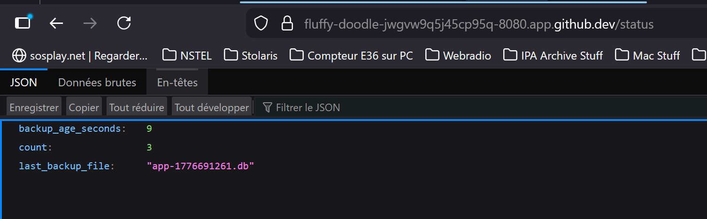

------------------------------------------------------------------------------------------------------
ATELIER PRA/PCA
------------------------------------------------------------------------------------------------------
L’idée en 30 secondes : Cet atelier met en œuvre un **mini-PRA** sur **Kubernetes** en déployant une **application Flask** avec une **base SQLite** stockée sur un **volume persistant (PVC pra-data)** et des **sauvegardes automatiques réalisées chaque minute vers un second volume (PVC pra-backup)** via un **CronJob**. L’**image applicative est construite avec Packer** et le **déploiement orchestré avec Ansible**, tandis que Kubernetes assure la gestion des pods et de la disponibilité applicative. Nous observerons la différence entre **disponibilité** (recréation automatique des pods sans perte de données) et **reprise après sinistre** (perte volontaire du volume de données puis restauration depuis les backups), nous mesurerons concrètement les RTO et RPO, et comprendrons les limites d’un PRA local non répliqué. Cet atelier illustre de manière pratique les principes de continuité et de reprise d’activité, ainsi que le rôle respectif des conteneurs, du stockage persistant et des mécanismes de sauvegarde.
  
**Architecture cible :** Ci-dessous, voici l'architecture cible souhaitée.   
  
  
  
-------------------------------------------------------------------------------------------------------
Séquence 1 : Codespace de Github
-------------------------------------------------------------------------------------------------------
Objectif : Création d'un Codespace Github  
Difficulté : Très facile (~5 minutes)
-------------------------------------------------------------------------------------------------------
**Faites un Fork de ce projet**. Si besoin, voici une vidéo d'accompagnement pour vous aider à "Forker" un Repository Github : [Forker ce projet](https://youtu.be/p33-7XQ29zQ) 
  
Ensuite depuis l'onglet **[CODE]** de votre nouveau Repository, **ouvrez un Codespace Github**.
  
---------------------------------------------------
Séquence 2 : Création du votre environnement de travail
---------------------------------------------------
Objectif : Créer votre environnement de travail  
Difficulté : Simple (~10 minutes)
---------------------------------------------------
Vous allez dans cette séquence mettre en place un cluster Kubernetes K3d contenant un master et 2 workers, installer les logiciels Packer et Ansible. Depuis le terminal de votre Codespace copier/coller les codes ci-dessous étape par étape :  

**Création du cluster K3d**  
```
curl -s https://raw.githubusercontent.com/k3d-io/k3d/main/install.sh | bash
```
```
k3d cluster create pra \
  --servers 1 \
  --agents 2
```
**vérification de la création de votre cluster Kubernetes**  
```
kubectl get nodes
```
**Installation du logiciel Packer (création d'images Docker)**  
```
PACKER_VERSION=1.11.2
curl -fsSL -o /tmp/packer.zip \
  "https://releases.hashicorp.com/packer/${PACKER_VERSION}/packer_${PACKER_VERSION}_linux_amd64.zip"
sudo unzip -o /tmp/packer.zip -d /usr/local/bin
rm -f /tmp/packer.zip
```
**Installation du logiciel Ansible**  
```
python3 -m pip install --user ansible kubernetes PyYAML jinja2
export PATH="$HOME/.local/bin:$PATH"
ansible-galaxy collection install kubernetes.core
```
  
---------------------------------------------------
Séquence 3 : Déploiement de l'infrastructure
---------------------------------------------------
Objectif : Déployer l'infrastructure sur le cluster Kubernetes
Difficulté : Facile (~15 minutes)
---------------------------------------------------  
Nous allons à présent déployer notre infrastructure sur Kubernetes. C'est à dire, créér l'image Docker de notre application Flask avec Packer, déposer l'image dans le cluster Kubernetes et enfin déployer l'infratructure avec Ansible (Création du pod, création des PVC et les scripts des sauvegardes aututomatiques).  

**Création de l'image Docker avec Packer**  
```
packer init .
packer build -var "image_tag=1.0" .
docker images | head
```
  
**Import de l'image Docker dans le cluster Kubernetes**  
```
k3d image import pra/flask-sqlite:1.0 -c pra
```
  
**Déploiment de l'infrastructure dans Kubernetes**  
```
ansible-playbook ansible/playbook.yml
```
  
**Forward du port 8080 qui est le port d'exposition de votre application Flask**  
```
kubectl -n pra port-forward svc/flask 8080:80 >/tmp/web.log 2>&1 &
```
  
---------------------------------------------------  
**Réccupération de l'URL de votre application Flask**. Votre application Flask est déployée sur le cluster K3d. Pour obtenir votre URL cliquez sur l'onglet **[PORTS]** dans votre Codespace (à coté de Terminal) et rendez public votre port 8080 (Visibilité du port). Ouvrez l'URL dans votre navigateur et c'est terminé.  

**Les routes** à votre disposition sont les suivantes :  
1. https://...**/** affichera dans votre navigateur "Bonjour tout le monde !".
2. https://...**/health** pour voir l'état de santé de votre application.
3. https://...**/add?message=test** pour ajouter un message dans votre base de données SQLite.
4. https://...**/count** pour afficher le nombre de messages stockés dans votre base de données SQLite.
5. https://...**/consultation** pour afficher les messages stockés dans votre base de données.
  
---------------------------------------------------  
### Processus de sauvegarde de la BDD SQLite

Grâce à une tâche CRON déployée par Ansible sur le cluster Kubernetes (un CronJob), toutes les minutes une sauvegarde de la BDD SQLite est faite depuis le PVC pra-data vers le PCV pra-backup dans Kubernetes.  

Pour visualiser les sauvegardes périodiques déposées dans le PVC pra-backup, coller les commandes suivantes dans votre terminal Codespace :  

```
kubectl -n pra run debug-backup \
  --rm -it \
  --image=alpine \
  --overrides='
{
  "spec": {
    "containers": [{
      "name": "debug",
      "image": "alpine",
      "command": ["sh"],
      "stdin": true,
      "tty": true,
      "volumeMounts": [{
        "name": "backup",
        "mountPath": "/backup"
      }]
    }],
    "volumes": [{
      "name": "backup",
      "persistentVolumeClaim": {
        "claimName": "pra-backup"
      }
    }]
  }
}'
```
```
ls -lh /backup
```
**Pour sortir du cluster et revenir dans le terminal**
```
exit
```

---------------------------------------------------
Séquence 4 : 💥 Scénarios de crash possibles  
Difficulté : Facile (~30 minutes)
---------------------------------------------------
### 🎬 **Scénario 1 : PCA — Crash du pod**  
Nous allons dans ce scénario **détruire notre Pod Kubernetes**. Ceci simulera par exemple la supression d'un pod accidentellement, ou un pod qui crash, ou un pod redémarré, etc..

**Destruction du pod :** Ci-dessous, la cible de notre scénario   
  
  

Nous perdons donc ici notre application mais pas notre base de données puisque celle-ci est déposée dans le PVC pra-data hors du pod.  

Copier/coller le code suivant dans votre terminal Codespace pour détruire votre pod :
```
kubectl -n pra get pods
```
Notez le nom de votre pod qui est différent pour tout le monde.  
Supprimez votre pod (pensez à remplacer <nom-du-pod-flask> par le nom de votre pod).  
Exemple : kubectl -n pra delete pod flask-7c4fd76955-abcde  
```
kubectl -n pra delete pod <nom-du-pod-flask>
```
**Vérification de la suppression de votre pod**
```
kubectl -n pra get pods
```
👉 **Le pod a été reconstruit sous un autre identifiant**.  
Forward du port 8080 du nouveau service  
```
kubectl -n pra port-forward svc/flask 8080:80 >/tmp/web.log 2>&1 &
```
Observez le résultat en ligne  
https://...**/consultation** -> Vous n'avez perdu aucun message.
  
👉 Kubernetes gère tout seul : Aucun impact sur les données ou sur votre service (PVC conserve la DB et le pod est reconstruit automatiquement) -> **C'est du PCA**. Tout est automatique et il n'y a aucune rupture de service.
  
---------------------------------------------------
### 🎬 **Scénario 2 : PRA - Perte du PVC pra-data** 
Nous allons dans ce scénario **détruire notre PVC pra-data**. C'est à dire nous allons suprimer la base de données en production. Ceci simulera par exemple la corruption de la BDD SQLite, le disque du node perdu, une erreur humaine, etc. 💥 Impact : IL s'agit ici d'un impact important puisque **la BDD est perdue**.  

**Destruction du PVC pra-data :** Ci-dessous, la cible de notre scénario   
  
  

🔥 **PHASE 1 — Simuler le sinistre (perte de la BDD de production)**  
Copier/coller le code suivant dans votre terminal Codespace pour détruire votre base de données :
```
kubectl -n pra scale deployment flask --replicas=0
```
```
kubectl -n pra patch cronjob sqlite-backup -p '{"spec":{"suspend":true}}'
```
```
kubectl -n pra delete job --all
```
```
kubectl -n pra delete pvc pra-data
```
👉 Vous pouvez vérifier votre application en ligne, la base de données est détruite et la service n'est plus accéssible.  

✅ **PHASE 2 — Procédure de restauration**  
Recréer l’infrastructure avec un PVC pra-data vide.  
```
kubectl apply -f k8s/
```
Vérification de votre application en ligne.  
Forward du port 8080 du service pour tester l'application en ligne.  
```
kubectl -n pra port-forward svc/flask 8080:80 >/tmp/web.log 2>&1 &
```
https://...**/count** -> =0.  
https://...**/consultation** Vous avez perdu tous vos messages.  

Retaurez votre BDD depuis le PVC Backup.  
```
kubectl apply -f pra/50-job-restore.yaml
```
👉 Vous pouvez vérifier votre application en ligne, **votre base de données a été restaureé** et tous vos messages sont bien présents.  

Relance des CRON de sauvgardes.  
```
kubectl -n pra patch cronjob sqlite-backup -p '{"spec":{"suspend":false}}'
```
👉 Nous n'avons pas perdu de données mais Kubernetes ne gère pas la restauration tout seul. Nous avons du protéger nos données via des sauvegardes régulières (du PVC pra-data vers le PVC pra-backup). -> **C'est du PRA**. Il s'agit d'une stratégie de sauvegarde avec une procédure de restauration.  

---------------------------------------------------
Séquence 5 : Exercices  
Difficulté : Moyenne (~45 minutes)
---------------------------------------------------
**Complétez et documentez ce fichier README.md** pour répondre aux questions des exercices.  
Faites preuve de pédagogie et soyez clair dans vos explications et procedures de travail.  

### Exercice 1 : Quels sont les composants dont la perte entraîne une perte de données ?

Les deux composants dont la perte provoque une perte de données sont les **PVC (Persistent Volume Claims)** :

- **`pra-data`** : ce PVC contient la base de données SQLite en production. Sa perte signifie la perte de toutes les données actuelles de l'application. C'est exactement ce que nous avons simulé dans le scénario 2.
- **`pra-backup`** : ce PVC contient les copies de sauvegarde de la BDD. Si ce volume est perdu **en même temps** que `pra-data`, il n'existe plus aucun moyen de restaurer les données. C'est le point de défaillance ultime de cette architecture.

> ⚠️ En revanche, la perte d'un **pod** n'entraîne **aucune perte de données**. Le pod ne stocke rien de persistant : la BDD est montée depuis le PVC `pra-data`, et Kubernetes recrée automatiquement le pod via le `Deployment`. C'est ce que nous avons observé dans le scénario 1 (PCA).

---

### Exercice 2 : Pourquoi n'avons-nous pas perdu les données lors de la suppression du PVC `pra-data` ?

Lors du scénario 2, nous avons supprimé le PVC `pra-data` (la base de données de production), mais nous n'avons **pas perdu les données** grâce au **mécanisme de sauvegarde automatique** :

1. Un **CronJob Kubernetes** (`sqlite-backup`) s'exécute **toutes les minutes** et copie le fichier de base de données depuis le PVC `pra-data` vers le PVC `pra-backup`.
2. Au moment du sinistre, le PVC `pra-backup` contenait donc déjà une ou plusieurs **copies récentes** de la BDD.
3. La procédure de restauration (`pra/50-job-restore.yaml`) lance un **Job** qui copie la sauvegarde la plus récente depuis `pra-backup` vers le nouveau PVC `pra-data` vide.

C'est donc la **redondance des données sur un second volume** (`pra-backup`), combinée à une **procédure de restauration manuelle**, qui nous a permis de récupérer l'intégralité des données.

---

### Exercice 3 : Quels sont les RTO et RPO de cette solution ?

#### RPO (Recovery Point Objective) — Quantité maximale de données que l'on accepte de perdre

Le CronJob de sauvegarde s'exécute **toutes les minutes**. Dans le pire cas, le sinistre survient juste avant la prochaine sauvegarde planifiée.

> **RPO ≈ 1 minute** : on peut perdre au maximum les données écrites durant la dernière minute écoulée depuis le dernier backup.

#### RTO (Recovery Time Objective) — Durée nécessaire pour rétablir le service

La restauration nécessite plusieurs étapes **manuelles** :

1. Recréer le PVC vide : `kubectl apply -f k8s/`
2. Lancer le job de restauration : `kubectl apply -f pra/50-job-restore.yaml`
3. Relancer le `port-forward` et réactiver le CronJob de sauvegarde

> **RTO ≈ 2 à 5 minutes** : dépend de la réactivité de l'opérateur et de la taille de la BDD à restaurer.

---

### Exercice 4 : Pourquoi cette solution ne peut pas être utilisée en production ? Que manque-t-il ?

Plusieurs limites rendent cette architecture inappropriée pour un vrai environnement de production :

- **Sauvegarde locale, pas de réplication distante** : les deux PVC (`pra-data` et `pra-backup`) résident sur le **même cluster K3d**, potentiellement sur le même nœud physique. Un sinistre physique (incendie, panne matérielle globale) entraînerait la **perte simultanée des deux volumes**. Il faudrait une réplication hors-site (stockage objet distant type **S3**, NAS externe, ou un second cluster dans une autre zone/région).

- **SQLite n'est pas adapté à la production** : `SQLite` ne supporte pas les accès concurrents en écriture et ne passe pas à l'échelle. En production, on utiliserait **PostgreSQL**, **MySQL** ou un service managé (RDS, Cloud SQL…).

- **Restauration entièrement manuelle** : la procédure de PRA nécessite une **intervention humaine**. Il n'y a aucun mécanisme de détection automatique du sinistre ni de bascule automatique (failover).

- **Pas de haute disponibilité applicative** : un seul replica du `Deployment` Flask est déployé. En production, on aurait **plusieurs replicas** répartis sur différents nœuds avec un load balancer.

- **Pas de chiffrement ni de contrôle d'accès sur les backups** : les sauvegardes ne sont ni chiffrées, ni protégées par des politiques de rétention ou d'accès.

- **Pas de supervision ni d'alerting** : aucun monitoring (`Prometheus`, `Grafana`) ni système d'alerte (`PagerDuty`, `OpsGenie`) pour détecter une panne ou un échec de sauvegarde.

---

### Exercice 5 : Proposez une architecture plus robuste

#### Base de données

Remplacer `SQLite` par **PostgreSQL** déployé en haute disponibilité (par exemple via l'opérateur **CloudNativePG** ou **Patroni**) avec réplication synchrone entre un primaire et au moins un réplica, répartis sur des nœuds différents.

#### Sauvegarde externalisée

Les backups ne doivent plus rester dans le même cluster. Utiliser un outil comme **pgBackRest** ou **Velero** pour envoyer les sauvegardes vers un **stockage objet distant** (AWS S3, MinIO sur un site secondaire, Azure Blob…). Appliquer une politique de rétention (par exemple : backups horaires conservés 24h, quotidiens conservés 30 jours).

#### Multi-zone / multi-cluster

Déployer le cluster Kubernetes sur au moins **deux zones de disponibilité** (ou deux datacenters). En cas de perte d'une zone, le trafic est automatiquement routé vers la zone survivante.

#### Haute disponibilité applicative

Déployer **plusieurs replicas** du pod Flask avec un **Ingress Controller** ou un `LoadBalancer` en frontal, couplé à des **PodDisruptionBudgets** pour garantir un minimum de pods disponibles pendant les mises à jour ou les pannes.

#### Failover automatique

Mettre en place un mécanisme de bascule automatique. L'opérateur PostgreSQL gère le failover de la BDD. Pour l'application, le `Service` Kubernetes répartit automatiquement le trafic sur les pods sains.

#### Monitoring et alerting

Déployer **Prometheus + Grafana** pour la supervision, avec des alertes (via `Alertmanager` vers Slack, PagerDuty…) sur les métriques critiques : état des pods, espace disque des PVC, succès/échec des CronJobs de backup, latence applicative.

#### Chiffrement et sécurité

Chiffrer les backups au repos et en transit, appliquer des **NetworkPolicies** pour isoler les namespaces, et utiliser des **RBAC** stricts pour limiter l'accès aux PVC et aux opérations sensibles.

---------------------------------------------------
Séquence 6 : Ateliers  
Difficulté : Moyenne (~2 heures)
---------------------------------------------------
### **Atelier 1 : Ajoutez une fonctionnalité à votre application**  
**Ajouter une route GET /status** dans votre application qui affiche en JSON :
* count : nombre d’événements en base
* last_backup_file : nom du dernier backup présent dans /backup
* backup_age_seconds : âge du dernier backup



---------------------------------------------------
### **Atelier 2 : Choisir notre point de restauration**  
Aujourd’hui nous restaurobs “le dernier backup”. Nous souhaitons **ajouter la capacité de choisir un point de restauration**.

### Atelier 2 : Choisir notre point de restauration

#### Problème

Le job `pra/50-job-restore.yaml` restaure systématiquement le **dernier backup** disponible (`ls -t | head -1`). En situation réelle, le dernier backup peut lui-même contenir des données corrompues (par exemple si la corruption a eu lieu avant la sauvegarde). Il faut donc pouvoir **choisir un point de restauration précis**.

#### Solution

Un nouveau job `pra/51-job-restore-selective.yaml` accepte une variable d'environnement `BACKUP_FILE` qui permet de spécifier le fichier de backup à restaurer. Si aucun fichier n'est spécifié, le comportement par défaut reste la restauration du dernier backup.

#### Runbook — Procédure de restauration sélective

##### Étape 1 — Lister les backups disponibles

Lancer un pod temporaire pour consulter les fichiers de sauvegarde présents dans le PVC `pra-backup` :

```bash
kubectl -n pra run debug-backup \
  --rm -it \
  --image=alpine \
  --overrides='{
    "spec": {
      "containers": [{
        "name": "debug",
        "image": "alpine",
        "command": ["sh", "-c", "ls -lh /backup/ && echo && echo Nombre de backups: $(ls /backup/*.db | wc -l)"],
        "volumeMounts": [{"name": "backup", "mountPath": "/backup"}]
      }],
      "volumes": [{
        "name": "backup",
        "persistentVolumeClaim": {"claimName": "pra-backup"}
      }]
    }
  }'
```

Exemple de sortie :
```
-rw-r--r--  1 root root  12K  app-1776690000.db
-rw-r--r--  1 root root  12K  app-1776690060.db
-rw-r--r--  1 root root  16K  app-1776690120.db
-rw-r--r--  1 root root  16K  app-1776691261.db

Nombre de backups: 4
```

> Le timestamp Unix dans le nom de fichier correspond à l'heure de la sauvegarde. Pour convertir un timestamp en date lisible : `date -d @1776691261`

##### Étape 2 — Choisir le point de restauration

Identifier le fichier souhaité dans la liste. Par exemple, si on veut revenir à l'état de `app-1776690120.db`.

##### Étape 3 — Arrêter l'application et les sauvegardes

```bash
# Stopper le pod Flask
kubectl -n pra scale deployment flask --replicas=0

# Suspendre le CronJob de sauvegarde
kubectl -n pra patch cronjob sqlite-backup -p '{"spec":{"suspend":true}}'
```

##### Étape 4 — Supprimer l'ancien job de restauration (si existant)

```bash
kubectl -n pra delete job sqlite-restore-selective --ignore-not-found
```

##### Étape 5 — Lancer la restauration avec le fichier choisi

Utiliser `sed` pour injecter le nom du fichier dans le job, puis l'appliquer :

```bash
sed 's/__BACKUP_FILE__/app-1776690120.db/' pra/51-job-restore-selective.yaml | kubectl apply -f -
```

Vérifier que le job s'est terminé avec succès :

```bash
kubectl -n pra logs job/sqlite-restore-selective
```

Sortie attendue :
```
=== Restauration sélective ===
Restauration de : /backup/app-1776690120.db
Restauration terminée avec succès.
```

##### Étape 6 — Relancer l'application et les sauvegardes

```bash
# Relancer le pod Flask
kubectl -n pra scale deployment flask --replicas=1

# Réactiver le CronJob
kubectl -n pra patch cronjob sqlite-backup -p '{"spec":{"suspend":false}}'

# Relancer le port-forward
kubectl -n pra port-forward svc/flask 8080:80 >/tmp/web.log 2>&1 &
```

##### Étape 7 — Vérification

Accéder à l'application et confirmer que les données correspondent bien au point de restauration choisi :

- `https://.../count` → vérifier le nombre de messages
- `https://.../consultation` → vérifier le contenu des messages
- `https://.../status` → vérifier que le backup tourne à nouveau 
  
---------------------------------------------------
Evaluation
---------------------------------------------------
Cet atelier PRA PCA, **noté sur 20 points**, est évalué sur la base du barème suivant :  
- Série d'exerices (5 points)
- Atelier N°1 - Ajout d'un fonctionnalité (4 points)
- Atelier N°2 - Choisir son point de restauration (4 points)
- Qualité du Readme (lisibilité, erreur, ...) (3 points)
- Processus travail (quantité de commits, cohérence globale, interventions externes, ...) (4 points) 

